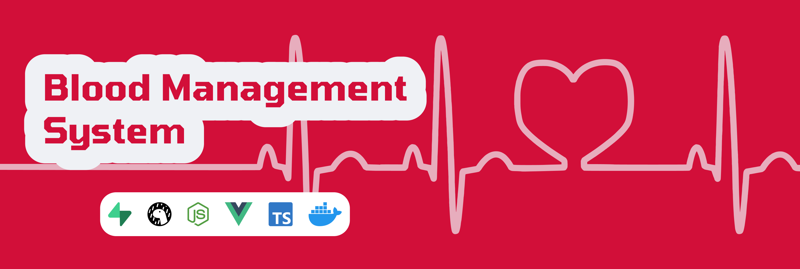

# Blood Donation Platform

## Project Idea

We create a platform that

## Project Implementation

- Frontend: Vue.js
- Backend: ASP.NET
- Database: PostgreSQL (with pgadmin)
- Deployment: Docker Compose

## How to contribute

1. Clone the repository
2. Open repository in terminal or IDE of choice
3. Install required tools to develop frontend or backend (shown in Tech stack)
4. Run `docker compose watch` to preview while coding

## How to use

1. Clone the repository
2. Open repository in terminal
3. Run `docker compose up -d` to deploy locally

## Stakeholders

### Current members

- Project Manager: **Nguyen Quoc Bao**, Student @ Swinburne University, HCMC, Vietnam
- Technical Leader: **Nguyen Ta Minh Triet**, Student @ Swinburne University, HCMC, Vietnam
- UI/UX Designer: **Nguyen Ngoc Anh**, Student @ Swinburne University, HCMC, Vietnam
- Supervisor: **Huynh Nguyen Quoc Bao**, Alumni @ Swinburne University, HCMC, Vietnam

### Former members

- Database: **Luu Hieu Khang**, Student @ Swinburne University, HCMC, Vietnam
- UI/UX Researcher: **Dang Quynh Chi**, Student @ Swinburne University, HCMC, Vietnam
- Mentor: **Dr. Minh Nguyen**, Former Lecturer @ Swinburne University, HCMC, Vietnam
- Supervisor: **Ms. Titan Vo**, Former Industry Liaison @ Swinburne University, HCMC, Vietnam
